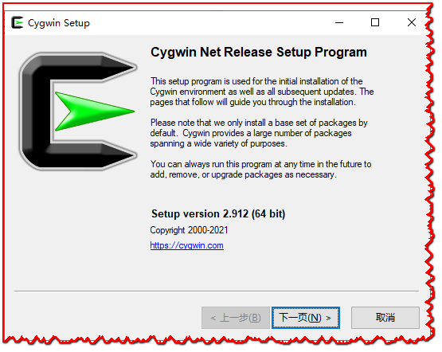
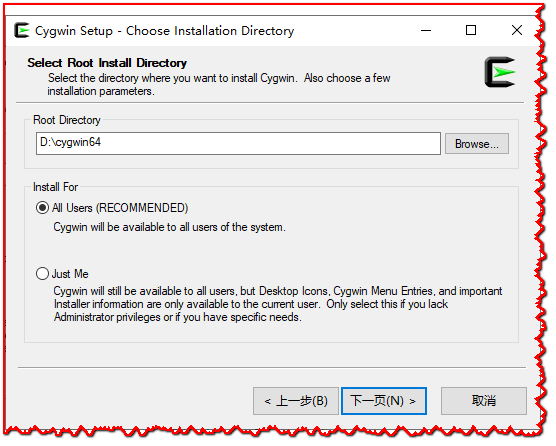
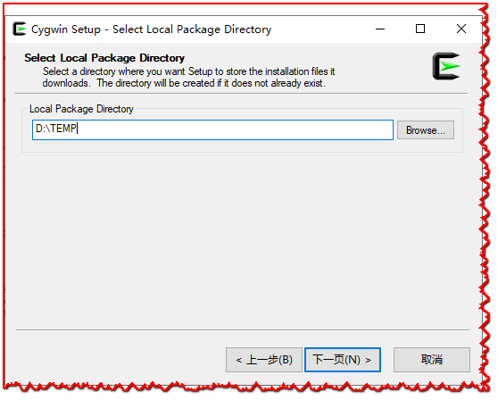
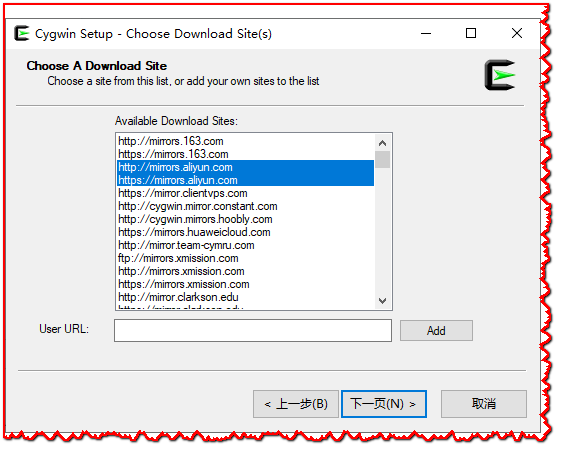
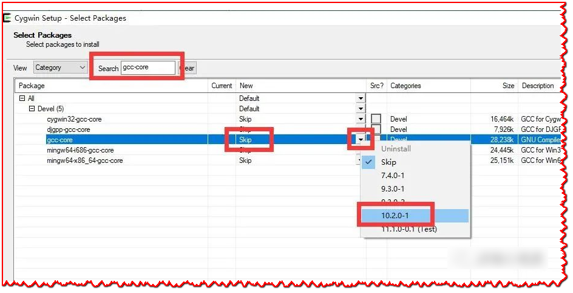
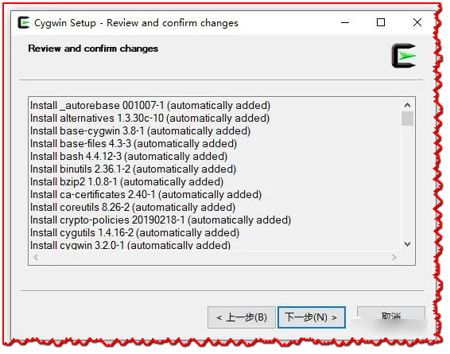
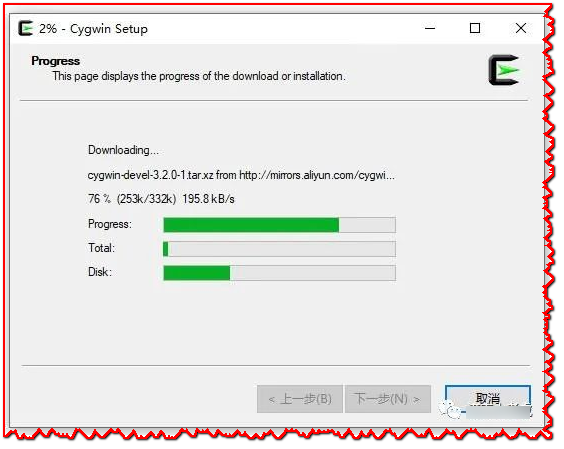
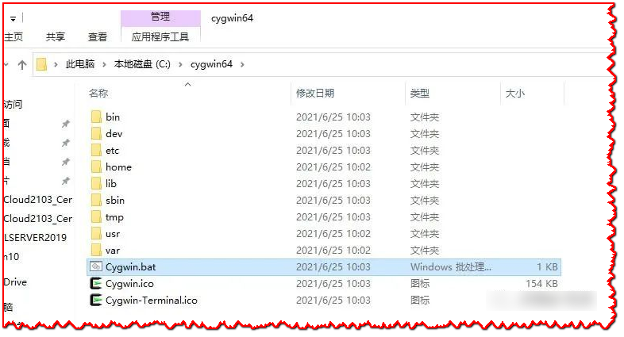
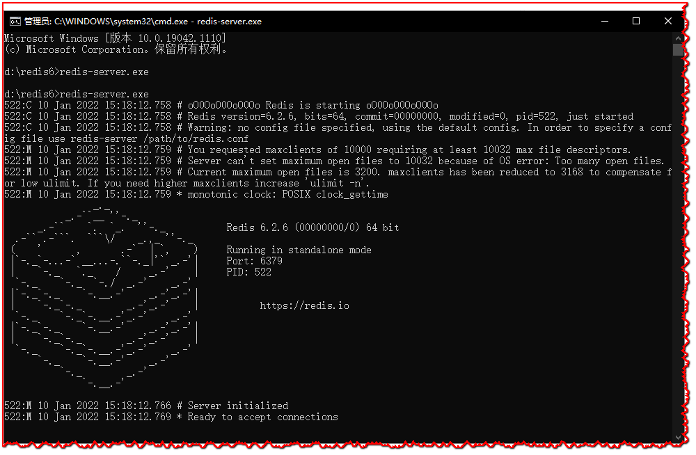

# redis-win-6-win64
自己编译好的windows下的64位的redis6可执行程序包.


## 背景说明

- 在github上面仅能够找到 redis3.2.100的Windows安装文件
- 比较新的版本比较难以找到, 同事经常出现这个版本的redis卡死的情况, 所以想尝试进行一下升级.

## 第 一步 下载文件


下载 cygwin的安装文件

```
https://cygwin.com/setup-x86_64.exe
```

下载redis的安装文件

```
https://download.redis.io/releases/redis-6.0.26.tar.gz
```

## 第 二步 cygwin的安装与设置

双击安装即可.



注意选择使用`Install from internet`

- 需要注意使用 `Root directory` 需要记住
- 后续编译的文件也是以这个文件为根目录进行处理的.



- 下一步的`Local Packages Directory` 指的是互联网下载的临时路径.



注意选择互联网安装可以add 一个 阿里云的 默认镜像,不然可能无法安装

```
http://mirrors.aliyun.com/cygwin/
```



- 注意这里需要通过Search 将部分组件添加进来以便进行编译.需要添加的主要有:

```
pkg-config make gcc-core gcc-g++ libgcc1 libgccpp1
```



- 注意 每一个单独的包都需要单独进行下载然后进行安装不能偷懒.
- 注意不要全部下载 不然会打爆磁盘
- 选择完成之后点击下一步进行安装即可



- 注意 这一步可能会很漫长,需要慢慢等待,有下载和安装的步骤



**安装完成之后就可以进行后续的编译操作了**

## 第 三步 编译安装redis6

- 启动cygwin



- 修改`cygwin64/usr/include/dlfcn.h`文件

  找到`Dl_info`定义的地方，删除上面的 `#if` 和 下面的 `#endif` 两 行.

- 把redis的tar包放到`cygwin64/tmp`目录下

```bash
tar -zxvf redis-6.2.6.tar.gz
cd redis-6.2.6
make
```

## 第 四步 启动验证

- 需要在 `redis-6.2.6/src` 里面将所有的生成的exe文件抽取出来

  ```
  redis-benchmark.exe
  redis-check-aof.exe 
  redis-check-rdb.exe 
  redis-cli.exe 
  redis-sentinel.exe 
  redis-server.exe 
  ```

  

- 需要把`cygwin64/bin` 目录下面的 `cygwin1.dll`这个文件一起放到`redis-server.exe`文件所在的目录里面

- 打开命令行,执行`redis-server.exe`,输出如下:



Redis6在Windows下的编译安装完成!
